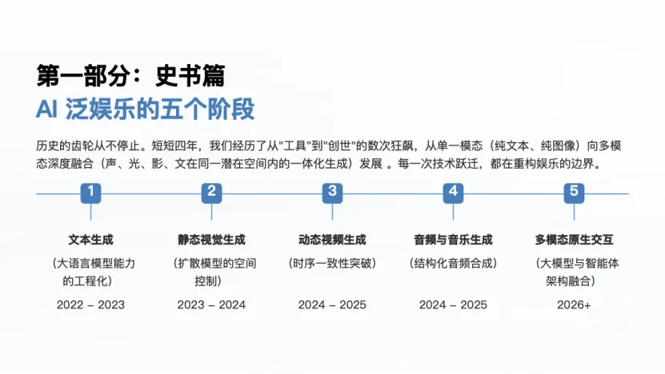

# LINK-X Capital 网站

星连资本官网，部署在 GitHub Pages：https://yl0223-ai.github.io/linkx-site/

## 项目结构

```
linkx-site/
├── index.html              主页
├── insights.html           洞察列表页
├── portfolio.html          投资组合
├── team.html               团队页
├── contact.html            联系页
├── legal.html              法律声明
│
├── news-*.html             新闻类文章
├── insights-*.html         观点类文章
├── portfolio-*.html        投资组合相关文章
│
├── assets/                 图片资源（团队照片、二维码等）
├── template-article.html   文章页模板（生成器使用）
└── generate.py             文章生成脚本
```

## 添加新文章

### 步骤 1：写 markdown 文件

把文章存为 `xxx.md`，结构如下：

```markdown
# 文章标题
副标题：可选的副标题

正文第一段。

## 二级标题

### 三级标题

正文段落，**这里是加粗**。

- 列表项 1
- 列表项 2


```

### 步骤 2：运行生成脚本

```bash
cd /Users/shenyalan/linkx-site
python3 generate.py <md文件> <日期> <标签1> [标签2...] [-o 输出名]
```

**示例：**

```bash
python3 generate.py 敢想敢为，基金25AGM.md 2025-11-21 news perspectives -o news-agm-2025
```

脚本会自动：

1. 生成 `news-agm-2025.html`（文章页）
2. 更新 `insights.html`（添加列表条目和月份分区）
3. 检查 JS 语法

### 步骤 3：编辑英文翻译（可选）

生成的 HTML 里英文 i18n 默认是中文占位符，打开生成的 html 文件，找到 `en: { ... }` 部分手动改英文翻译。

### 步骤 4：部署

```bash
git add -A
git commit -m "add: 文章标题"
git push
```

GitHub Pages 自动构建，1-2 分钟后线上生效。

## 标签

支持的标签（中英文映射）：

| 标签 | 中文 | 英文 |
|------|------|------|
| `news` | 新闻 | News |
| `perspectives` | 观点 | Perspectives |
| `portfolio` | 投资组合 | Portfolio |
| `research` | 研究 | Research |
| `spotlight` | 聚焦 | Spotlight |

需要新标签时，编辑 `generate.py` 顶部的 `TAG_MAP` 字典。

## 修改公共部分

### 修改导航/页脚/菜单

公共部分散落在多个 HTML 文件里。如果改了 header/footer/菜单，需要：

1. 改 `template-article.html`（新文章会用新版本）
2. 同步改已有的 HTML 文件

> 提示：未来如果需要，可以再写一个同步脚本批量更新所有页面的公共部分。

### 修改 CSS 样式

样式都内嵌在每个 HTML 的 `<style>` 标签里。常见改动：

- **颜色变量**：在 `:root { --purple: ...; }` 里改
- **字体大小**：搜 `font-size: clamp(...)` 改对应区域
- **响应式**：搜 `@media` 改断点

## 常见问题

**菜单点不开？**
通常是 i18n 字典里中文文字含 ASCII `"`（U+0022）破坏了 JS 字符串。解决：把 `"` 改成 `\"` 转义。

**图片不显示？**
检查 `.gitignore` 是否排除了图片文件，或图片路径是否正确。

**新文章列表没出现？**
检查 `insights.html` 的月份分区。`generate.py` 默认插到列表最上面，如果想插到中间可手动调整。

## 部署

GitHub 仓库：https://github.com/yl0223-ai/linkx-site

`main` 分支自动部署到 GitHub Pages。
